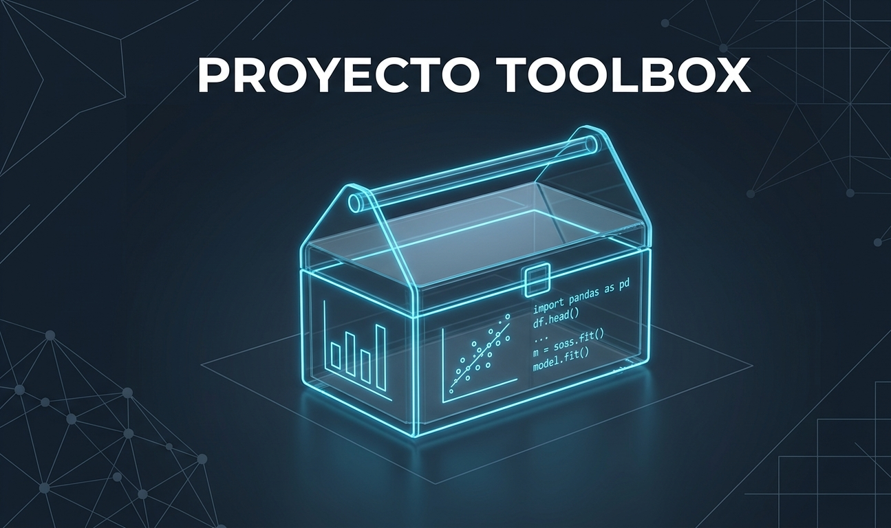

# Toolbox ML (`toolbox_ml`)

Una librería de Python para automatizar tareas de Análisis Exploratorio de Datos (EDA) y selección de características en proyectos de Machine Learning orientados a regresión.

## Instalación

Para instalar el paquete de forma local y en modo desarrollo, ejecuta los siguientes comandos en tu terminal:

```bash
# 1. Clonar el repositorio
git clone [https://github.com/vuestro-grupo/toolbox_ml.git](https://github.com/vuestro-grupo/toolbox_ml.git)
cd toolbox_ml

# 2. Crear y activar entorno virtual
python -m venv venv
source venv/bin/activate  # En Windows usa: venv\Scripts\activate

# 3. Instalar dependencias y el paquete en modo editable
pip install -r requirements.txt
pip install -e .
```
## Estructura del repositorio
```
TC-ToolBox/
├── README.md                  # Descripción del proyecto
├── .venv/                     # Entorno virtual de trabajo
├── notebooks/                 # Espacio para pruebas y análisis
│   └── demo.ipynb             # El cuaderno de demostración
├── tests
│    ├── __init__.py           # Mostrador de tests
│    └── test_core.py          # Tests unitarios
├── toolbox_ml/                # El paquete instalable del proyecto
│   ├── __init__.py            # El conmutador central y gestor de accesos
│   ├── data/                  # Archivos para el proyecto
│   └── eda/                   # Módulo de Análisis Exploratorio
│       ├── __init__.py        # Mostrador de EDA
│       └── core.py            # Archivo único con todas las funciones unificadas
├── .github/
│    └── workflows/
│        └── tests.yml         # Configuración pytests automáticos   
├── requirements.txt           # Listado oficial de dependencias
├── setup.py                   # Configuradores de instalación
└── __init__.py                # El conmutador central y gestor de accesos               
```

## Funciones Principales (`toolbox_ml.eda.core`)

La librería expone las siguientes funciones diseñadas para acelerar el pipeline de Data Science:

### 1. Análisis Descriptivo General
* **`describe_df(df)`**: Genera un DataFrame resumen que calcula para cada columna el tipo de datos, el porcentaje de valores nulos, la cantidad de valores únicos y su porcentaje de cardinalidad.
* **`tipifica_variables(df, umbral_categoria, umbral_continua)`**: Sugiere de manera automática el tipo de variable analizada (`Binaria`, `Categórica`, `Numérica Continua` o `Numérica Discreta`) en función de su cardinalidad.

### 2. Feature Selection para Regresión
* **`get_features_num_regression(df, target_col, umbral_corr, pvalue)`**: Filtra y devuelve las variables numéricas que tienen una correlación de Pearson lineal significativa con la variable objetivo, permitiendo filtrar opcionalmente por significancia estadística (p-valor).
* **`plot_features_num_regression(df, target_col, columns, umbral_corr, pvalue)`**: Genera gráficos de dispersión (*pairplots*) automáticos de las variables numéricas que cumplen las condiciones de correlación. Si se seleccionan más de 5 variables, los divide inteligentemente en subplots de máximo 5 columnas para evitar saturación visual.
* **`get_features_cat_regression(df, target_col, pvalue)`**: Identifica variables categóricas cuya relación con la variable objetivo numérica sea automáticamente significativa mediante tests estadísticos (**Mann-Whitney U** para 2 categorías o **ANOVA** para más de 2 categorías).
* **`plot_features_cat_regression(df, target_col, columns, pvalue, with_individual_plot)`**: Pinta histogramas o diagramas de densidad agrupados por las categorías de las variables seleccionadas frente a la variable *target*.

## Ejecución de Tests Unitarios

Para garantizar la estabilidad del código y asegurar que ninguna modificación rompa las funcionalidades existentes, se ha implementado una suite de tests robustos utilizando `pytest`.

Para ejecutar todos los tests unitarios automatizados desde la terminal, mantén el entorno virtual activo y lanza el siguiente comando en la raíz del proyecto:

```bash
pytest tests/ -v
```

## Miembros del Equipo y Reparto de Tareas

El desarrollo del paquete y las tareas de integración se distribuyeron bajo la metodología Scrum de la siguiente manera:

* **María** - *Scrum Master*: Gestión integral del repositorio de GitHub, configuración y control de la protección de la rama `main`, diseño de la arquitectura y estructura inicial del paquete, documentación global (`README.md`), control técnico del entorno virtual y desarrollo del Notebook de Demostración.
* **Marta** - *Data Engineer / Developer 1*: Implementación de la lógica del análisis descriptivo de DataFrames (`describe_df`) y del algoritmo para la tipificación automática de variables (`tipifica_variables`) en el archivo `core.py`. Diseño y ejecución de sus respectivos tests unitarios con `pytest`.
* **Claudia** - *Data Scientist / Developer 2*: Desarrollo del bloque completo de Feature Selection para regresión. Implementación del filtrado estadístico y visualización tanto de variables numéricas (test de Pearson y pairplots) como categóricas (tests ANOVA / Mann-Whitney U e histogramas de densidad). Diseño y ejecución de sus respectivos tests unitarios.